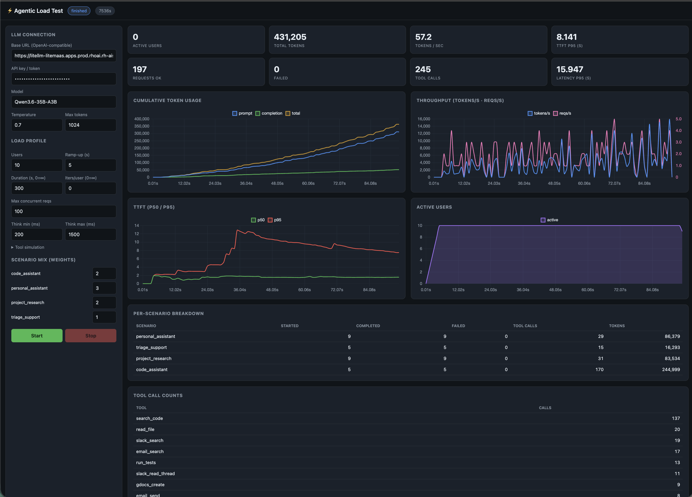

# Agentic Load Test

A load-test tool that simulates many concurrent users running **real, multi-turn,
tool-calling agentic applications** against an OpenAI-compatible LLM endpoint.

The reasoning and tool selection are driven by **real LLM calls** — so the load
profile matches production agentic traffic — while the tools themselves (Slack,
Google Docs, email, calendar, a code assistant) are **simulated**. You configure
the model connection and the number of users, pick a mix of scenarios, and watch
token usage, TTFT, latency, and throughput grow live in a dashboard.



## What it simulates

Each simulated user repeatedly picks a weighted scenario and runs an agent loop:

```
system(persona) + user(goal)
  → assistant (decides to call tools)        ← real LLM call (streamed, measured)
     → simulated tool results                ← fixtures, or LLM-fabricated fallback
  → assistant reasons over results, repeats
  → next follow-up user turn (multi-turn)
```

Shipped scenarios (`config/scenarios/*.yaml`):

| Scenario | What it does |
|---|---|
| `personal_assistant` | OpenClaw-style daily catch-up across email/Slack/calendar |
| `project_research` | Collate Project Atlas info from Slack → create a summary Google Doc → email it |
| `code_assistant` | Investigate a bug, write a fix, run tests |
| `triage_support` | Short, high-frequency triage of an incoming request |

Add a scenario by dropping a YAML file in `config/scenarios/` (no code needed).
Add a tool in `src/agentic_loadtest/tools/registry.py` and a fixture in
`fixtures/*.json`. Add a large system-prompt harness by dropping a `.md`/`.txt`
file in `config/prompts/` — it appears in the UI's preset picker automatically.

## Metrics

Live, per-second and cumulative:

- **Token usage growth** (prompt / completion / total) across all users
- **TTFT** p50 / p95 / p99 (measured from streamed first token)
- **Request latency** p50 / p95 / p99
- **Throughput**: tokens/sec and requests/sec
- **Active users**, total/failed requests, error breakdown
- **Per-scenario** started/completed/failed/tokens, and **per-tool** call counts

## Configuration

Everything is tunable from the UI (or `config/config.example.yaml`):

- **LLM connection**: base URL, API key, model, temperature, max tokens, timeout
- **System prompt (agent harness)**: a large, shared preamble prepended to every
  scenario — mimicking the big standing system prompts of Claude Code / Hermes so
  prompt-token counts start high and grow fast. Pick a shipped preset
  (`config/prompts/*.md`), paste your own, or point `preamble_file` at a file.
  `position: prepend` layers it over the scenario persona; `replace` uses it alone.
- **Load profile**: users, ramp-up, duration (or iterations/user), max concurrent
  in-flight requests, think-time between turns
- **Tool simulation**: fixtures-first with optional LLM fallback; simulated tool
  latency range
- **Scenario mix**: per-scenario weights

The LLM connection can also come from the environment (handy with an OpenShift
Secret): `ALT_LLM_API_KEY`, `ALT_LLM_BASE_URL`, `ALT_LLM_MODEL`.

## Run locally

```bash
python3 -m venv .venv && .venv/bin/pip install -r requirements.txt
PYTHONPATH=src .venv/bin/python -m agentic_loadtest.main
# open http://localhost:8080
```

Server env vars: `ALT_HOST` (default `0.0.0.0`), `ALT_PORT` (`8080`),
`ALT_CONFIG`, `ALT_SCENARIOS_DIR`, `ALT_FIXTURES_DIR`.

## Test without a real model

A mock OpenAI-compatible streaming server is included:

```bash
PYTHONPATH=src .venv/bin/python -m uvicorn tests.mock_openai:app --port 8099 &
PYTHONPATH=src .venv/bin/python tests/e2e_run.py   # drives a short run, asserts metrics
```

## Container

```bash
# Build for the cluster's architecture. OpenShift nodes are usually amd64, so on
# Apple Silicon add --platform=linux/amd64 (otherwise the image won't run there).
podman build --platform=linux/amd64 -t agentic-loadtest -f Containerfile .
podman run -p 8080:8080 -e ALT_LLM_API_KEY=sk-... agentic-loadtest
```

The image is based on UBI9 Python and runs as an **arbitrary non-root UID in
group 0** (OpenShift `restricted-v2` SCC compatible). Permission setup runs as
root at build time, then the runtime drops to a non-root user. Verified by
running locally as a random UID:

```bash
podman run --user 100777:0 -p 8081:8080 agentic-loadtest   # mimics OpenShift
```

## Deploy to OpenShift

```bash
oc new-project agentic-loadtest
oc create secret generic agentic-loadtest-llm --from-literal=api_key=sk-...

# Build in-cluster from Git…
oc apply -f openshift/buildconfig.yaml
oc start-build agentic-loadtest --follow
# …or push a locally built image to the internal registry.

oc apply -f openshift/deployment.yaml -f openshift/service.yaml -f openshift/route.yaml
oc get route agentic-loadtest -o jsonpath='{.spec.host}{"\n"}'
```

## Architecture

| Module | Responsibility |
|---|---|
| `config.py` | `RunConfig` (per-run, UI-editable) + `ServerSettings` (env) |
| `llm.py` | Async OpenAI-compatible client; streams to measure TTFT, accumulates tool-call deltas, captures token usage; global concurrency gate |
| `tools/` | Tool schemas (`registry.py`) + hybrid fixture/LLM simulator (`simulator.py`) |
| `scenarios.py` | YAML scenario loading |
| `agent.py` | Multi-turn tool-calling agent loop for one scenario |
| `orchestrator.py` | Ramps up N users, weighted scenario selection, duration/stop, per-second sampler |
| `metrics.py` | In-memory aggregation, percentiles, timeline |
| `api.py` / `main.py` | FastAPI REST + WebSocket + static dashboard |
| `static/` | Single-page dashboard (vanilla JS + Chart.js) |

### Scaling note

A single asyncio process comfortably drives hundreds of users because the work
is IO-bound (waiting on the model). `max_concurrent_requests` caps in-flight HTTP
requests so user count and socket count are decoupled. For thousands of users,
run multiple pod replicas and aggregate metrics externally (e.g. Prometheus) —
the current metrics store is per-process and in-memory.
